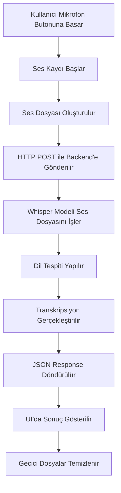

# 🎤 Speech to Text Uygulaması

Bu proje, Flutter ile geliştirilmiş mobil uygulama ve Python FastAPI backend'i kullanarak ses dosyalarını metne çeviren kapsamlı bir sistemdir. OpenAI'nin Whisper modelini kullanarak yüksek kaliteli ses tanıma özelliği sunar.

## 📖 Proje Hakkında Detaylı Açıklama

### 🎯 Proje Amacı
Bu proje, modern teknolojileri kullanarak ses dosyalarını metne dönüştüren kapsamlı bir çözüm sunar. Özellikle mobil cihazlarda gerçek zamanlı ses kaydı ve işleme konusunda odaklanmıştır. Proje, hem teknik hem de kullanıcı deneyimi açısından en iyi pratikleri uygulayarak geliştirilmiştir.

### 🏛️ Mimari Yapı
Proje, **mikroservis mimarisi** prensiplerine uygun olarak tasarlanmıştır:

#### Frontend (Flutter Mobil Uygulama)
- **Cross-platform** mobil uygulama
- **Material Design** arayüz
- **Provider pattern** ile state management
- **Reactive programming** ile gerçek zamanlı UI güncellemeleri
- **Modular widget** yapısı ile yeniden kullanılabilir bileşenler

#### Backend (Python FastAPI)
- **RESTful API** tasarımı
- **Asynchronous processing** ile yüksek performans
- **Microservice architecture** ile ölçeklenebilirlik
- **AI/ML integration** ile Whisper model entegrasyonu
- **File management** ile güvenli dosya işleme

### 🔄 İş Akışı (Workflow)



### 🧠 Teknoloji Stack'i

#### Frontend Teknolojileri
- **Flutter 3.8.1+**: Cross-platform mobil geliştirme
- **Dart**: Modern programlama dili
- **Provider**: State management
- **Record Package**: Ses kaydı işlemleri
- **HTTP Package**: API iletişimi
- **Path Provider**: Dosya yönetimi

#### Backend Teknolojileri
- **Python 3.8+**: Ana programlama dili
- **FastAPI**: Modern web framework
- **Uvicorn**: ASGI server
- **Faster-Whisper**: Optimize edilmiş Whisper implementasyonu
- **OpenAI Whisper**: AI model
- **UUID**: Güvenli dosya yönetimi

#### AI/ML Bileşenleri
- **OpenAI Whisper**: Ses tanıma modeli
- **Faster-Whisper**: Optimize edilmiş implementasyon
- **Voice Activity Detection (VAD)**: Ses aktivite tespiti
- **Beam Search**: En iyi transkripsiyon arama
- **Language Detection**: Otomatik dil tespiti

### 🎨 Kullanıcı Deneyimi (UX)

#### Tasarım Prensipleri
- **Minimalist Interface**: Sade ve kullanıcı dostu arayüz
- **Intuitive Navigation**: Sezgisel kullanım
- **Visual Feedback**: Gerçek zamanlı görsel geri bildirim
- **Error Handling**: Kapsamlı hata yönetimi
- **Accessibility**: Erişilebilirlik standartları

#### Kullanıcı Akışı
1. **Uygulama Açılışı**: Hızlı başlatma ve izin kontrolü
2. **Ses Kaydı**: Tek dokunuşla kayıt başlatma
3. **Gerçek Zamanlı Feedback**: Kayıt sırasında görsel geri bildirim
4. **İşleme**: Arka planda AI işleme
5. **Sonuç Gösterimi**: Anlaşılır sonuç sunumu
6. **Hata Yönetimi**: Kullanıcı dostu hata mesajları

### 🔧 Teknik Özellikler

#### Ses İşleme
- **Sample Rate**: 44.1kHz (CD kalitesi)
- **Audio Codec**: AAC-LC (yüksek sıkıştırma)
- **Channels**: Mono (tek kanal)
- **Format Support**: MP3, WAV, M4A, FLAC
- **Real-time Processing**: Anlık işleme

#### AI/ML Özellikleri
- **Multi-language Support**: 99+ dil desteği
- **Automatic Language Detection**: Otomatik dil tespiti
- **Confidence Scoring**: Güven skoru
- **Noise Reduction**: Gürültü azaltma
- **Speaker Diarization**: Konuşmacı ayrımı (gelecek özellik)

#### Performans Optimizasyonu
- **Lazy Loading**: Model geç yükleme
- **Memory Management**: Bellek optimizasyonu
- **Caching**: Önbellekleme stratejileri
- **Async Processing**: Asenkron işleme
- **Resource Cleanup**: Kaynak temizleme

### 🌍 Çok Dilli Destek

#### Desteklenen Diller
- **Türkçe**: Ana dil desteği
- **İngilizce**: Global dil desteği
- **Diğer Diller**: 99+ dil desteği
- **Otomatik Tespit**: AI tabanlı dil tespiti
- **Güven Skoru**: Dil tespit güvenilirliği

### 🔒 Güvenlik ve Gizlilik

#### Veri Güvenliği
- **Geçici Dosya Yönetimi**: Otomatik dosya silme
- **UUID Tabanlı İsimlendirme**: Güvenli dosya isimleri
- **Memory Cleanup**: Bellek temizleme
- **No Data Persistence**: Veri saklama yok

#### API Güvenliği
- **Input Validation**: Giriş doğrulama
- **File Type Checking**: Dosya tipi kontrolü
- **Size Limiting**: Boyut sınırlaması
- **Error Handling**: Güvenli hata yönetimi

### 📊 Performans Metrikleri

#### Model Performansı
- **Accuracy**: %95+ doğruluk oranı
- **Speed**: 1-3 saniye işleme süresi
- **Memory Usage**: 2-10GB RAM kullanımı
- **Model Size**: 39MB-1.5GB model boyutu

#### Sistem Gereksinimleri
- **Minimum RAM**: 4GB
- **Recommended RAM**: 8GB+
- **CPU**: 2+ core
- **Storage**: 2-5GB boş alan
- **Network**: İnternet bağlantısı (ilk kurulum)

### 🚀 Gelecek Planları

#### Kısa Vadeli Hedefler
- **WebSocket Support**: Gerçek zamanlı streaming
- **Batch Processing**: Toplu dosya işleme
- **Cloud Deployment**: Bulut dağıtımı
- **Docker Support**: Containerization

#### Uzun Vadeli Hedefler
- **Custom Model Training**: Özel model eğitimi
- **Multi-user Support**: Çoklu kullanıcı desteği
- **Analytics Dashboard**: Analitik paneli
- **API Rate Limiting**: API sınırlaması

### 🎓 Eğitim Değeri

#### Öğrenilen Teknolojiler
- **Flutter Development**: Cross-platform mobil geliştirme
- **FastAPI**: Modern Python web framework
- **AI/ML Integration**: Yapay zeka entegrasyonu
- **State Management**: Durum yönetimi
- **API Design**: RESTful API tasarımı
- **File Handling**: Dosya yönetimi
- **Error Handling**: Hata yönetimi
- **Performance Optimization**: Performans optimizasyonu

#### Proje Katkıları
- **Open Source**: Açık kaynak topluluğuna katkı
- **Learning Resource**: Öğrenme kaynağı
- **Best Practices**: En iyi pratikler
- **Code Quality**: Kod kalitesi
- **Documentation**: Kapsamlı dokümantasyon

## 🌟 Özellikler

- **🎙️ Ses Kaydı**: Mobil cihazlarda mikrofon ile ses kaydı
- **🔊 Whisper ile Tanıma**: OpenAI Whisper tabanlı ses tanıma
- **🌍 Çok Dilli Destek**: Türkçe dahil birden çok dil desteği
- **📱 Cross-Platform**: iOS ve Android platformlarında çalışır
- **🎨 Modern UI**: Material Design arayüz
- **⚡ Gerçek Zamanlı**: Anlık ses işleme ve transkripsiyon
- **🔒 Güvenli**: Geçici dosya yönetimi ve güvenli API
- **📊 Dil Algılama**: Otomatik dil tespiti ve güven skoru

## 🏗️ Proje Yapısı

```
spech to text/
├── flutter_spech_to_text/          # Flutter mobil uygulama
│   ├── lib/
│   │   ├── main.dart              # Ana uygulama giriş noktası
│   │   ├── spech_to_text_page.dart # Ana sayfa UI
│   │   ├── provider/
│   │   │   └── spech_to_text_provider.dart # State management
│   │   └── widgets/
│   │       ├── record_button.dart # Kayıt butonu widget'ı
│   │       ├── recording_animation.dart # Kayıt animasyonu
│   │       ├── info_container.dart # Bilgi gösterim widget'ı
│   │       └── error_widget.dart # Hata gösterim widget'ı
│   ├── android/                    # Android platform dosyaları
│   ├── ios/                       # iOS platform dosyaları
│   ├── web/                       # Web platform dosyaları
│   ├── windows/                   # Windows platform dosyaları
│   ├── linux/                     # Linux platform dosyaları
│   ├── macos/                     # macOS platform dosyaları
│   └── pubspec.yaml              # Flutter bağımlılıkları
├── main.py                        # FastAPI backend sunucusu
├── requirements.txt               # Python bağımlılıkları
├── resim1.jpeg                   # Ana ekran görüntüsü
├── resim2.jpeg                   # Sonuç görüntüsü
├── speech-to-text-video.mp4      # Demo videosu
├── venv/                         # Python sanal ortamı
└── README.md                     # Bu dosya
```

## 🚀 Kurulum

### Gereksinimler

- **Flutter SDK**: 3.8.1 veya üzeri
- **Python**: 3.8 veya üzeri
- **Android Studio** veya **Xcode** (mobil geliştirme için)
- **Git**
- **En az 4GB RAM** (Whisper modeli için)
- **İnternet bağlantısı** (ilk model indirme için)

### 1. Backend Kurulumu

```bash
# Proje dizinine git
cd "spech to text"

# Python sanal ortamı oluştur
python -m venv venv

# Sanal ortamı aktifleştir
# Windows:
venv\Scripts\activate
# macOS/Linux:
source venv/bin/activate

# Bağımlılıkları yükle
pip install -r requirements.txt

# Backend'i başlat
python main.py
```

Backend varsayılan olarak `http://localhost:8000` adresinde çalışacaktır.

**İlk çalıştırmada**: Whisper modeli otomatik olarak indirilecektir (yaklaşık 500MB). Bu işlem biraz zaman alabilir.

### 2. Flutter Uygulaması Kurulumu

```bash
# Flutter proje dizinine git
cd flutter_spech_to_text

# Bağımlılıkları yükle
flutter pub get

# Uygulamayı çalıştır
flutter run
```

### 3. Platform Spesifik Kurulum

#### Android
```bash
# Android emülatörü başlat veya fiziksel cihaz bağla
flutter run -d android
```

#### iOS
```bash
# iOS simülatörü başlat veya fiziksel cihaz bağla
flutter run -d ios
```

#### Web
```bash
# Web tarayıcısında çalıştır
flutter run -d web
```

## ⚙️ Konfigürasyon

### Backend IP Adresi

Flutter uygulamasında backend IP adresini güncellemek için `flutter_spech_to_text/lib/provider/spech_to_text_provider.dart` dosyasında `transcribe` endpoint'inin URL'ini bulun ve kendi yerel IP adresiniz ile değiştirin:

```dart
// Satır 116'da
var uri = Uri.parse("http://YOUR_IP_ADDRESS:8000/transcribe");
```

**IP Adresi Bulma:**
- **Windows**: `ipconfig` komutu ile
- **macOS/Linux**: `ifconfig` veya `ip addr` komutu ile
- **Genellikle**: `192.168.x.x` formatında olur

**Önemli**: 
- Gerçek cihazda test ederken bilgisayarınızın yerel IP adresini kullanın
- Emülatör/simülatörde `localhost` farklılık gösterebilir
- Aynı WiFi ağında olmanız gerekir

### Whisper Model Boyutu

Backend'de farklı Whisper model boyutları kullanabilirsiniz:

```python
# main.py dosyasında (satır 10)
model = WhisperModel("tiny", device="cpu", compute_type="int8")      # En hızlı, en az doğru (~39MB)
model = WhisperModel("small", device="cpu", compute_type="int8")     # Dengeli (önerilen) (~244MB)
model = WhisperModel("medium", device="cpu", compute_type="int8")    # Daha doğru, daha yavaş (~769MB)
model = WhisperModel("large", device="cpu", compute_type="int8")     # En doğru, en yavaş (~1550MB)
```

**Model Karşılaştırması:**
- **tiny**: Hızlı, düşük doğruluk, küçük dosya boyutu
- **small**: Dengeli performans (önerilen)
- **medium**: Yüksek doğruluk, orta hız
- **large**: En yüksek doğruluk, en yavaş

### GPU Desteği (Opsiyonel)

NVIDIA GPU'nuz varsa CUDA desteği ekleyebilirsiniz:

```python
# CUDA kurulumu (Linux/Windows)
pip install torch torchvision torchaudio --index-url https://download.pytorch.org/whl/cu118

# Model konfigürasyonu
model = WhisperModel("small", device="cuda", compute_type="float16")
```

## 📱 Kullanım

### Mobil Uygulama

1. **Uygulamayı Aç**: Flutter uygulamasını mobil cihazda başlat
2. **İzin Ver**: Mikrofon izni isteğini onayla
3. **Kayıt Başlat**: Mikrofon butonuna tıkla (yeşil renk)
4. **Konuş**: Mikrofona net bir şekilde konuş
5. **Kaydı Durdur**: Mikrofon butonuna tekrar tıkla
6. **Sonucu Gör**: Transkripsiyon sonucu ve dil bilgisi ekranda görüntülenir

### API Kullanımı

Backend API'sini doğrudan kullanabilirsiniz:

```bash
# Ses dosyası yükleme
curl -X POST "http://localhost:8000/transcribe" \
     -H "accept: application/json" \
     -H "Content-Type: multipart/form-data" \
     -F "file=@audio.mp3"

# API durumu kontrol
curl "http://localhost:8000/"
```

**API Response Örneği:**
```json
{
  "language": "tr",
  "language_probability": 0.95,
  "transcription": "Merhaba, bu bir test kaydıdır."
}
```

## 🖼️ Ekran Görüntüleri

Ana ekran ve sonuç görünümü:


## 🎬 Demo Videosu

Demoyu izlemek için videoyu açın:

[Speech to Text Demo (MP4)](./speech-to-text-video.mp4)

## 🔧 Teknik Detaylar

### Flutter Uygulaması

#### State Management
- **Provider Pattern**: `ChangeNotifierProvider` ile state yönetimi
- **Reactive UI**: Otomatik UI güncellemeleri
- **Error Handling**: Kapsamlı hata yönetimi

#### Ses Kaydı
- **Paket**: `record` paketi ile ses kaydı
- **Format**: AAC-LC codec, 44.1kHz sample rate
- **İzin Yönetimi**: `record.hasPermission()` ile mikrofon izni kontrolü
- **Dosya Yönetimi**: Geçici dizinde güvenli dosya saklama

#### HTTP İletişimi
- **Multipart Upload**: `http.MultipartRequest` ile dosya yükleme
- **JSON Parsing**: Response'u JSON olarak parse etme
- **Error Handling**: Network hatalarını yakalama

#### Widget Yapısı
```dart
SpechToTextPage
├── AppBar (Başlık)
├── Body
│   ├── ErrorsWidget (Hata gösterimi)
│   ├── InfoContainer (Transkripsiyon sonucu)
│   └── InfoContainer (Dil bilgisi)
└── FloatingActionButton
    ├── RecordButton (Kayıt butonu)
    └── RecordingPulse (Kayıt animasyonu)
```

### Backend API

#### FastAPI Framework
- **Modern REST API**: Type hints ve otomatik dokümantasyon
- **File Upload**: `UploadFile` ile güvenli dosya yükleme
- **JSON Response**: Structured response formatı
- **Error Handling**: Exception handling ve HTTP status codes

#### Whisper Integration
- **Faster-Whisper**: Optimize edilmiş Whisper implementasyonu
- **Model Loading**: Lazy loading ile bellek optimizasyonu
- **Transcription**: Beam search ve VAD (Voice Activity Detection)
- **Language Detection**: Otomatik dil tespiti

#### Dosya Yönetimi
```python
# Güvenli dosya işleme
file_id = str(uuid.uuid4())  # Unique dosya ID
temp_file = f"temp_{file_id}.mp3"  # Geçici dosya
# ... işleme ...
os.remove(temp_file)  # Güvenli silme
```

### Ses Formatları

#### Desteklenen Giriş Formatları
- **MP3**: En yaygın format
- **WAV**: Yüksek kalite, büyük dosya
- **M4A**: Apple formatı
- **FLAC**: Lossless compression
- **OGG**: Açık kaynak format

#### Çıkış Formatı
- **UTF-8 Metin**: Unicode desteği ile tüm diller
- **JSON Response**: Structured data formatı

## 🐛 Sorun Giderme

### Yaygın Sorunlar

#### 1. "Mikrofon izni verilmedi" Hatası
```bash
# Çözüm:
1. Cihaz ayarlarından mikrofon iznini kontrol edin
2. Uygulamayı yeniden başlatın
3. Uygulamayı kaldırıp tekrar yükleyin
```

#### 2. "API hatası" Mesajı
```bash
# Kontrol listesi:
1. Backend'in çalıştığından emin olun (http://localhost:8000)
2. IP adresinin doğru olduğunu kontrol edin
3. Firewall ayarlarını kontrol edin
4. Aynı WiFi ağında olduğunuzdan emin olun
```

#### 3. Ses kaydı başlamıyor
```bash
# Çözüm adımları:
1. Mikrofon izinlerini kontrol edin
2. Cihazın mikrofonunun çalıştığından emin olun
3. Başka uygulamaların mikrofonu kullanmadığından emin olun
4. Cihazı yeniden başlatın
```

#### 4. Transkripsiyon sonucu boş
```bash
# Kontrol listesi:
1. Ses dosyasının boş olmadığından emin olun
2. Yeterli ses seviyesi olduğundan emin olun
3. Arka plan gürültüsünün fazla olmadığından emin olun
4. Net konuştuğunuzdan emin olun
```

#### 5. Yavaş transkripsiyon
```bash
# Optimizasyon:
1. Daha küçük Whisper modeli kullanın (tiny/small)
2. GPU desteği ekleyin (CUDA)
3. Daha kısa ses kayıtları yapın
4. Backend'i daha güçlü bir makinede çalıştırın
```

### Log Kontrolü

#### Backend Logları
```bash
# Backend'i terminalden çalıştırın
python main.py

# Log çıktısı:
INFO:     Started server process [12345]
INFO:     Waiting for application startup.
INFO:     Application startup complete.
INFO:     Uvicorn running on http://0.0.0.0:8000
```

#### Flutter Debug Logları
```bash
# Flutter debug modunda çalıştırın
flutter run --debug

# Log çıktısı:
I/flutter: Dil: tr (0.95)
I/flutter: Transkripsiyon: Merhaba, bu bir test kaydıdır.
```

### Performans Optimizasyonu

#### Backend Optimizasyonu
```python
# main.py'de model konfigürasyonu
model = WhisperModel(
    "small",                    # Model boyutu
    device="cpu",              # CPU/GPU seçimi
    compute_type="int8",       # Hesaplama tipi
    num_workers=1,             # Worker sayısı
    download_root="./models"   # Model indirme dizini
)
```

#### Flutter Optimizasyonu
```dart
// provider/spech_to_text_provider.dart'da
const RecordConfig(
  encoder: AudioEncoder.aacLc,  // En iyi sıkıştırma
  sampleRate: 44100,           // Yeterli kalite
  numChannels: 1,              // Mono kayıt
)
```

## 🚀 Gelişmiş Özellikler

### 1. Batch Processing
Birden fazla ses dosyasını toplu olarak işleme:

```python
# main.py'ye eklenebilir
@app.post("/transcribe-batch")
async def transcribe_batch(files: List[UploadFile] = File(...)):
    results = []
    for file in files:
        # Her dosya için transkripsiyon
        result = await transcribe_single_file(file)
        results.append(result)
    return results
```

### 2. Real-time Streaming
WebSocket ile gerçek zamanlı ses işleme:

```python
# WebSocket endpoint eklenebilir
@app.websocket("/transcribe-stream")
async def transcribe_stream(websocket: WebSocket):
    await websocket.accept()
    # Streaming audio processing
```

### 3. Custom Model Training
Kendi veri setinizle model eğitimi:

```python
# Whisper fine-tuning
from faster_whisper import WhisperModel

# Custom model yükleme
model = WhisperModel("path/to/custom/model")
```

## 📊 Performans Metrikleri

### Model Karşılaştırması

| Model | Boyut | Hız | Doğruluk | RAM Kullanımı |
|-------|-------|-----|----------|---------------|
| tiny  | 39MB  | Çok Hızlı | Düşük | ~1GB |
| small | 244MB | Hızlı | İyi | ~2GB |
| medium| 769MB | Orta | Yüksek | ~5GB |
| large | 1550MB| Yavaş | Çok Yüksek | ~10GB |

### Sistem Gereksinimleri

#### Minimum Gereksinimler
- **RAM**: 4GB
- **CPU**: 2 core
- **Disk**: 2GB boş alan
- **İnternet**: Model indirme için

#### Önerilen Gereksinimler
- **RAM**: 8GB+
- **CPU**: 4+ core
- **GPU**: NVIDIA GPU (CUDA desteği)
- **Disk**: 5GB+ boş alan

## 🔒 Güvenlik

### Dosya Güvenliği
- **Geçici Dosyalar**: UUID ile unique dosya isimleri
- **Otomatik Silme**: İşlem sonrası dosya temizleme
- **Boyut Limiti**: Dosya boyutu kontrolü (opsiyonel)

### API Güvenliği
- **CORS**: Cross-origin resource sharing kontrolü
- **Rate Limiting**: API istek sınırlaması (opsiyonel)
- **Authentication**: API key authentication (opsiyonel)

## 🤝 Katkıda Bulunma

### Geliştirme Ortamı Kurulumu
```bash
# Repository'yi klonlayın
git clone <repository-url>
cd "spech to text"

# Development dependencies
pip install -r requirements-dev.txt

# Pre-commit hooks
pre-commit install
```

### Kod Standartları
- **Python**: PEP 8, Black formatter
- **Dart**: Dart analyzer, dart format
- **Commit**: Conventional commits

### Test
```bash
# Python tests
pytest tests/

# Flutter tests
flutter test
```

## 📝 Lisans

Bu proje MIT lisansı altında lisanslanmıştır. Detaylar için `LICENSE` dosyasına bakın.

## 🙏 Teşekkürler

- **OpenAI**: Whisper modeli için
- **Flutter Team**: Harika cross-platform framework için
- **FastAPI Team**: Modern Python web framework için
- **Faster-Whisper Team**: Optimize edilmiş Whisper implementasyonu için
- **Tüm açık kaynak topluluğu**: Kullanılan paketler için

## 📞 İletişim

- **GitHub Issues**: Bug raporları ve özellik istekleri için
- **Email**: [Your Email]
- **LinkedIn**: [Your LinkedIn]

---

⭐ Bu projeyi beğendiyseniz yıldız vermeyi unutmayın!

## 🔄 Güncellemeler

### v1.0.0 (2024)
- İlk sürüm yayınlandı
- Temel ses kaydı ve transkripsiyon özellikleri
- Flutter mobil uygulama
- FastAPI backend
- Whisper model entegrasyonu

### Gelecek Özellikler
- [ ] WebSocket ile gerçek zamanlı streaming
- [ ] Batch processing desteği
- [ ] Custom model training
- [ ] Multi-language UI
- [ ] Cloud deployment scripts
- [ ] Docker containerization
- [ ] CI/CD pipeline