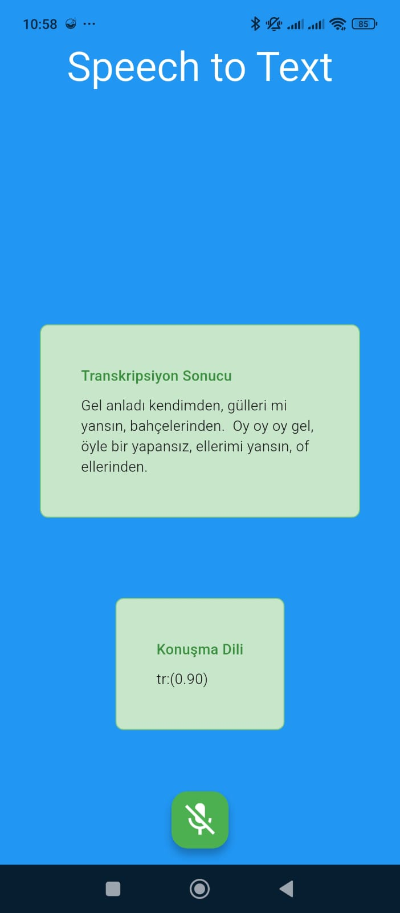
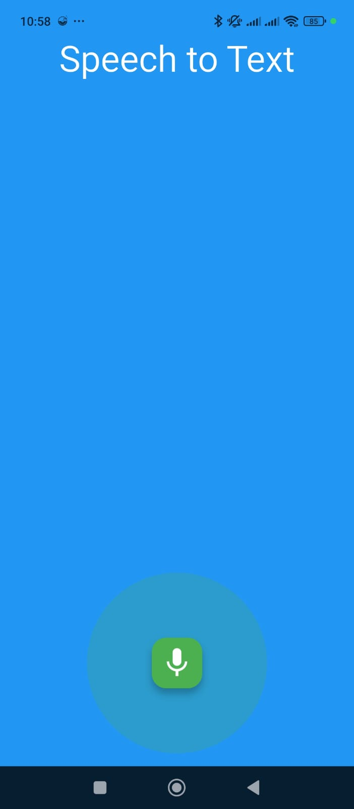

# 🎤 Speech to Text Uygulaması

Bu proje, Flutter ile geliştirilmiş mobil uygulama ve Python FastAPI backend'i kullanarak ses dosyalarını metne çeviren kapsamlı bir sistemdir. OpenAI'nin Whisper modelini kullanarak yüksek kaliteli ses tanıma özelliği sunar.

## 🌟 Özellikler

- **🎙️ Ses Kaydı**: Mobil cihazlarda mikrofon ile ses kaydı
- **🔊 Whisper ile Tanıma**: OpenAI Whisper tabanlı ses tanıma
- **🌍 Çok Dilli Destek**: Türkçe dahil birden çok dil desteği
- **📱 Cross-Platform**: iOS ve Android platformlarında çalışır
- **🎨 Modern UI**: Material Design arayüz

## 🏗️ Proje Yapısı

```
spech to text/
├── flutter_spech_to_text/          # Flutter mobil uygulama
│   ├── lib/
│   │   ├── main.dart              # Ana uygulama giriş noktası
│   │   ├── spech_to_text_page.dart # Ana sayfa UI
│   │   └── provider/
│   │       └── spech_to_text_provider.dart # State management
│   ├── android/                    # Android platform dosyaları
│   ├── ios/                       # iOS platform dosyaları
│   └── pubspec.yaml              # Flutter bağımlılıkları
├── main.py                        # FastAPI backend sunucusu
├── requirements.txt               # Python bağımlılıkları
└── README.md                     # Bu dosya
```

## 🚀 Kurulum

### Gereksinimler

- **Flutter SDK**: 3.8.1 veya üzeri
- **Python**: 3.8 veya üzeri
- **Android Studio** veya **Xcode** (mobil geliştirme için)
- **Git**

### 1. Backend Kurulumu

```bash
# Proje dizinine git
cd "spech to text"

# Python sanal ortamı oluştur
python -m venv venv

# Sanal ortamı aktifleştir
# Windows:
venv\Scripts\activate
# macOS/Linux:
source venv/bin/activate

# Bağımlılıkları yükle
pip install -r requirements.txt

# Backend'i başlat
python main.py
```

Backend varsayılan olarak `http://localhost:8000` adresinde çalışacaktır.

### 2. Flutter Uygulaması Kurulumu

```bash
# Flutter proje dizinine git
cd flutter_spech_to_text

# Bağımlılıkları yükle
flutter pub get

# Uygulamayı çalıştır
flutter run
```

## ⚙️ Konfigürasyon

### Backend IP Adresi

Flutter uygulamasında backend IP adresini güncellemek için `flutter_spech_to_text/lib/provider/spech_to_text_provider.dart` dosyasında `transcribe` endpoint'inin URL'ini bulun ve kendi yerel IP adresiniz ile değiştirin:

```dart
var uri = Uri.parse("http://YOUR_IP_ADDRESS:8000/transcribe");
```

**Önemli**: Gerçek cihazda test ederken bilgisayarınızın yerel IP adresini kullanın (örn: `192.168.1.100`). Emülatör/simülatörde `localhost` farklılık gösterebilir.

Not: Uygulama istek atarken kullandığınız URL'deki IP adresini kendi ağınızdaki backend sunucusunun IP'siyle değiştirebilirsiniz.

### Whisper Model Boyutu

Backend'de farklı Whisper model boyutları kullanabilirsiniz:

```python
# main.py dosyasında
model = WhisperModel("tiny", device="cpu", compute_type="int8")      # En hızlı, en az doğru
model = WhisperModel("small", device="cpu", compute_type="int8")     # Dengeli (önerilen)
model = WhisperModel("medium", device="cpu", compute_type="int8")    # Daha doğru, daha yavaş
model = WhisperModel("large", device="cpu", compute_type="int8")     # En doğru, en yavaş
```

## 📱 Kullanım

### Mobil Uygulama

1. **Uygulamayı Aç**: Flutter uygulamasını mobil cihazda başlat
2. **İzin Ver**: Mikrofon izni isteğini onayla
3. **Kayıt Başlat**: "Kayıt Başlat" butonuna tıkla
4. **Konuş**: Mikrofona konuş
5. **Kaydı Durdur**: "Kaydı Durdur" butonuna tıkla
6. **Sonucu Gör**: Transkripsiyon sonucu ekranda görüntülenir

## 🖼️ Ekran Görüntüleri

Ana ekran ve sonuç görünümü:





## 🎬 Demo Videosu

Demoyu izlemek için videoyu açın:

[Speech to Text Demo (MP4)](./speech%20to%20text%20video.mp4)

### API Kullanımı

Backend API'sini doğrudan kullanabilirsiniz:

```bash
# Ses dosyası yükleme
curl -X POST "http://localhost:8000/transcribe" \
     -H "accept: application/json" \
     -H "Content-Type: multipart/form-data" \
     -F "file=@audio.mp3"

# API durumu kontrol
curl "http://localhost:8000/"
```

## 🔧 Teknik Detaylar

### Flutter Uygulaması

- **State Management**: Provider pattern
- **Ses Kaydı**: `record` paketi
- **HTTP İstekleri**: `http` paketi ile multipart form-data
- **İzin Yönetimi**: `record.hasPermission()` ile mikrofon izni kontrolü

### Backend API

- **Framework**: FastAPI ile modern REST API
- **Ses İşleme**: Faster-Whisper ile optimize edilmiş Whisper modeli
- **Dosya Yönetimi**: Güvenli dosya yükleme ve geçici dosya işleme
- **ASGI Sunucu**: Uvicorn ile yüksek performanslı sunucu

### Ses Formatları

- **Giriş**: MP3, WAV, M4A, FLAC (backend tarafından algılanır)
- **Çıkış**: UTF-8 metin

## 🐛 Sorun Giderme

### Yaygın Sorunlar

1. **"Mikrofon izni verilmedi" Hatası**

   - Cihaz ayarlarından mikrofon iznini kontrol edin
   - Uygulamayı yeniden başlatın

2. **"API hatası" Mesajı**

   - Backend'in çalıştığından emin olun
   - IP adresinin doğru olduğunu kontrol edin
   - Firewall ayarlarını kontrol edin

3. **Ses kaydı başlamıyor**

   - Mikrofon izinlerini kontrol edin
   - Cihazın mikrofonunun çalıştığından emin olun

4. **Transkripsiyon sonucu boş**
   - Ses dosyasının boş olmadığından emin olun
   - Yeterli ses seviyesi olduğundan emin olun

### Log Kontrolü

Backend loglarını görmek için backend'i terminalden çalıştırın:

```bash
python main.py
```

## 🙏 Teşekkürler

- **OpenAI**: Whisper modeli için
- **Flutter Team**: Harika cross-platform framework için
- **FastAPI Team**: Modern Python web framework için
- **Tüm açık kaynak topluluğu**: Kullanılan paketler için

---

⭐ Bu projeyi beğendiyseniz yıldız vermeyi unutmayın!
